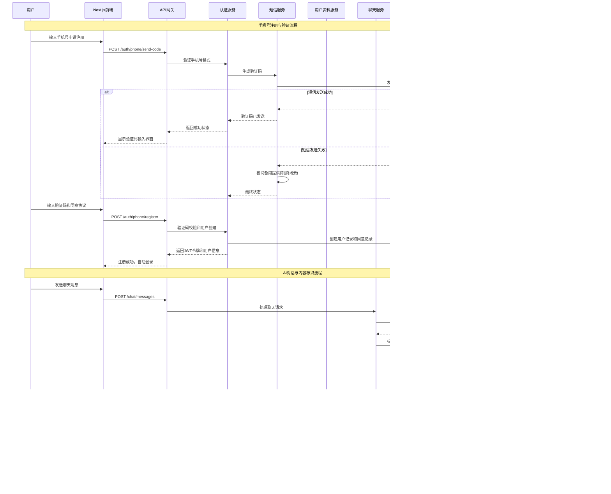

# 核心工作流程

## 用户注册与验证流程

```mermaid
sequenceDiagram
    participant User as 用户
    participant WebApp as Next.js前端
    participant Gateway as API网关
    participant AuthSvc as 认证服务
    participant SMSSvc as 短信服务
    participant ProfileSvc as 用户资料服务
    participant ChatSvc as 聊天服务
    participant ContentSvc as 内容标识服务
    participant DB as 数据库
    participant SMS_Provider as 短信提供商
    participant LLM as 大语言模型

    Note over User, SMS_Provider: 手机号注册与验证流程
    
    User->>WebApp: 输入手机号申请注册
    WebApp->>Gateway: POST /auth/phone/send-code
    Gateway->>AuthSvc: 验证手机号格式
    AuthSvc->>SMSSvc: 生成验证码
    SMSSvc->>SMS_Provider: 发送短信验证码
    
    alt 短信发送成功
        SMS_Provider-->>SMSSvc: 发送确认
        SMSSvc-->>AuthSvc: 验证码已发送
        AuthSvc-->>Gateway: 返回成功状态
        Gateway-->>WebApp: 显示验证码输入界面
    else 短信发送失败
        SMS_Provider-->>SMSSvc: 发送失败
        SMSSvc->>SMSSvc: 尝试备用提供商(腾讯云)
        SMSSvc-->>AuthSvc: 最终状态
    end

    User->>WebApp: 输入验证码和同意协议
    WebApp->>Gateway: POST /auth/phone/register
    Gateway->>AuthSvc: 验证码校验和用户创建
    AuthSvc->>DB: 创建用户记录和同意记录
    AuthSvc-->>Gateway: 返回JWT令牌和用户信息
    Gateway-->>WebApp: 注册成功，自动登录

    Note over User, LLM: AI对话与内容标识流程
    
    User->>WebApp: 发送聊天消息
    WebApp->>Gateway: POST /chat/messages
    Gateway->>ChatSvc: 处理聊天请求
    ChatSvc->>LLM: 调用AI模型生成回复
    LLM-->>ChatSvc: 返回AI生成内容
    
    ChatSvc->>ContentSvc: 标识AI生成内容
    ContentSvc->>ContentSvc: 添加文本标识
    
    alt 包含图片/视频
        ContentSvc->>ContentSvc: 添加水印处理
    end
    
    ContentSvc->>DB: 保存内容标识记录
    ChatSvc->>DB: 保存聊天消息
    ChatSvc-->>Gateway: 返回带标识的内容
    Gateway-->>WebApp: 实时显示带AI标识的回复
    WebApp->>User: 显示"内容由AI生成，仅供参考"
```

---

**由BMAD™核心产品管理框架生成**