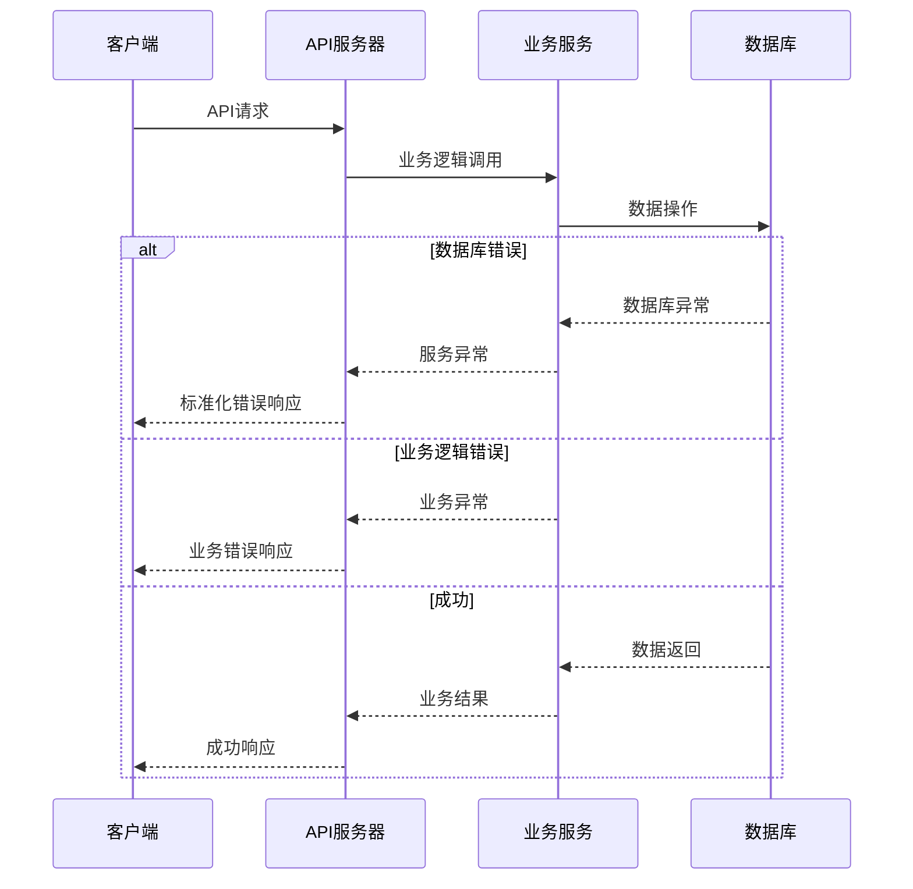

# 错误处理策略

## 错误流程



## 错误响应格式

```typescript
interface ApiError {
  error: {
    code: string;
    message: string;
    details?: Record<string, any>;
    timestamp: string;
    requestId: string;
  };
}
```

---

**由BMAD™核心产品管理框架生成**