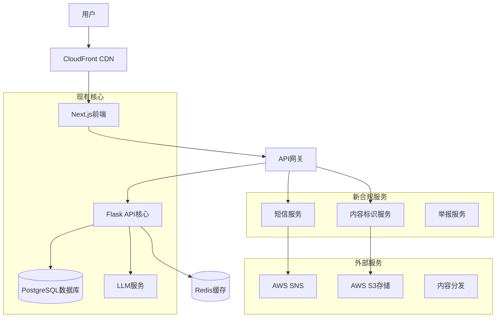

# 高层架构

## 技术总结

增强的Open WebUI平台将利用建立在现有Flask后端和Next.js 15前端基础上的**现代全栈架构**，扩展了**合规导向的微服务**用于短信验证、内容标识和用户管理。该架构采用**混合部署方法**，结合传统容器化服务与用于短信处理的无服务器函数，通过**统一API网关模式**集成，保持向下兼容性。关键集成点包括实时内容标识中间件、短信服务适配器和增强的用户认证流程，无缝扩展现有聊天界面。基础设施利用**基于Docker的部署**与云原生短信和存储服务，确保可扩展性的同时保留当前开发工作流程和系统性能特征。

## 平台和基础设施选择

**平台：** AWS (Amazon Web Services)
**关键服务：** ECS/Fargate (容器), SNS (短信), S3 (存储), RDS (数据库), CloudFront (CDN), API Gateway, Cognito (增强认证)
**部署主机和区域：** 多区域部署 (美国东部, 亚太地区用于中国市场合规)

## 仓库结构

**结构：** 增强的Monorepo (扩展当前结构)
**Monorepo工具：** 保持当前方法，通过增强的Docker Compose进行服务编排
**包组织：** 合规服务基于功能的包，前端/后端之间的共享类型

```
当前: /api (Flask) + /web (Next.js) 
增强: /api + /web + /services (合规) + /shared (类型)
```

## 高层架构图



## 架构模式

- **带有单体核心的微服务：** 为核心聊天功能维护现有Flask单体，同时为合规功能添加专注的微服务 - _理由:_ 保持系统稳定性，同时实现新功能的独立扩展

- **API网关模式：** 所有API调用的单一入口点，请求路由到适当的服务 - _理由:_ 集中认证、速率限制和监控，同时保持向下兼容性

- **事件驱动架构：** 短信发送和内容标识的异步处理，避免阻塞主聊天流程 - _理由:_ 在处理合规操作时保持响应式用户体验

- **仓库模式：** 为现有和新数据模型抽象数据访问逻辑 - _理由:_ 实现一致的数据处理和未来数据库优化的灵活性

- **带有功能标志的基于组件的UI：** 通过功能标志控制的合规功能扩展现有React组件 - _理由:_ 安全推出新功能而不干扰现有用户体验

- **短信适配器模式：** 通过通用接口的可插拔短信提供商(AWS SNS、腾讯云等) - _理由:_ 不同区域部署和成本优化的灵活性

---

**由BMAD™核心产品管理框架生成**